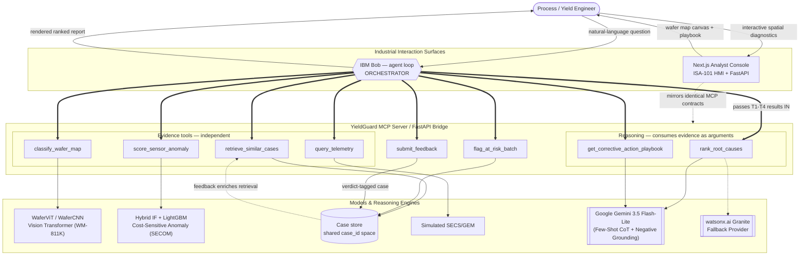

# Architecture

IBM Bob is the interaction surface **and the orchestrator**. The engineer chats with Bob;
Bob decides which MCP tools to call, in what order, and carries each tool's result into the
next. The YieldGuard MCP server exposes capabilities — it never chains its own tools.

## System architecture



**The critical edge is `BOB ==>|passes T1-T4 results IN| T5`.** Bob acts as the orchestrator chaining tools, while the Next.js Analyst Console provides cleanroom yield engineers with a high-density, ISA-101 compliant visualization surface driven by the exact same underlying MCP tool contracts.

## Components

| Component | Technology | Responsibility |
|---|---|---|
| Interaction & orchestration | **IBM Bob** (CLI / IDE agent) + `.bob/skills/yieldguard` | Autonomous tool selection, chaining, and conversational investigation |
| Industrial HMI Console | **Next.js 16 + React 19 + Tailwind CSS** (ISA-101) | Fleet overview, interactive 64x64 wafer canvas, cleanroom dispatch playbook |
| API Layer | **FastAPI + Uvicorn** (`src/api/main.py`) | Proxies MCP tool functions with typed OpenAPI schemas and CORS |
| Tool server | Python + `mcp` SDK 2.x (`MCPServer`, stdio) | Exposes 8 contract tools + `pipeline_status` |
| Defect classifier | PyTorch `WaferCNN` (615,801 params), WM-811K, TTA-8 | `classify_wafer_map` (macro-F1 0.9232; a ViT-Tiny was trained on the same split and rejected at 0.6981) |
| Anomaly detector | Hybrid Isolation Forest + HistGradientBoosting, SECOM | `score_sensor_anomaly` (Cost-sensitive 14:1 weighting) |
| Batch risk | Cosine similarity vs low-yield parameter profiles | `flag_at_risk_batch` |
| Case store | JSON + pure-Python cosine similarity | `retrieve_similar_cases`, feedback write-back |
| Telemetry | Simulated SECS/GEM lookup | `query_telemetry` |
| Reasoning | **Google Gemini 3.5 Flash-Lite** (Primary) & **watsonx.ai** (Fallback) | `rank_root_causes`, `get_corrective_action_playbook` |
| Eval harness | `mcp` client over stdio | 18 sub-cases, 277 assertions; 18/18 mocked, 16/18 live. Also reports coverage, excursion sensitivity and abstention |

**Bob does not use watsonx.ai as its own backend** — Bob routes across its own models.
watsonx.ai is called *by our server*: `Bob → MCP → YieldGuard server → ibm-watsonx-ai SDK →
Granite`. This matches the reference architecture and is why the reasoning call lives behind
a tool rather than in Bob's prompt.

## Data flow

**Post-mortem.** Bob calls `classify_wafer_map` and `score_sensor_anomaly` (independent, no
ordering dependency). It uses the resulting defect class and sensor signature to call
`retrieve_similar_cases`, then `query_telemetry` on the equipment named by those cases. All
four results are passed as arguments into `rank_root_causes`, which builds a fused evidence
bundle for watsonx.ai. The server validates the response — **any hypothesis without a cited
evidence source is dropped** — mints a `hypothesis_id` per surviving hypothesis, and returns
a rank-ordered list. `get_corrective_action_playbook` runs on the top hypothesis. The
engineer's verdict goes back through `submit_feedback` into the case store, where it
enriches future retrieval.

**Pre-run.** No wafer map, no test data. `flag_at_risk_batch` scores planned process
parameters against historically low-yield profiles. Only flagged lots get the expensive
follow-up. `rank_root_causes` receives `classification=null, anomaly=null` and produces
pre-run risk drivers.

**Degradation.** If a tool fails, Bob reports the gap and returns partial evidence. It never
substitutes a confident-sounding guess. `query_telemetry` distinguishes "no drift" from "no
such tool" by returning an explicit error row rather than an empty list.

## Key interfaces

```python
classify_wafer_map(image_path)                    -> {predicted_class, confidence}
score_sensor_anomaly(lot_id, sensors)             -> {anomaly_score, top_deviating_sensors}
retrieve_similar_cases(defect_class, signature, top_k)
                                                  -> {cases:[{case_id, similarity,
                                                     confirmed_root_cause, outcome, category}]}
query_telemetry(equipment_ids, time_window)       -> {telemetry:[{parameter, direction,
                                                     magnitude_sigma, recent_trend}],
                                                     equipment_meta}
rank_root_causes(classification, anomaly, cases, telemetry)
                                                  -> {hypotheses:[{hypothesis_id, rank,
                                                     description, confidence, category,
                                                     evidence_summary}]}
get_corrective_action_playbook(top_hypothesis, preventive)
                                                  -> {actions:[{description, priority}]}
flag_at_risk_batch(lot_id, planned_process_params)
                                                  -> {at_risk, similarity_to_historical_low_yield,
                                                     matched_case_ids, threshold_used}
submit_feedback(hypothesis_id, verdict, notes)    -> {status, feedback_id}
pipeline_status()                                 -> {tools:{name: real|stub}, ...}
```

Full contracts and the six amendments applied during the build:
[`../src/contracts/CONTRACTS.md`](../src/contracts/CONTRACTS.md).

## Design notes

**`hypothesis_id` is minted at the MCP boundary.** The frozen contract returned no id, but
`submit_feedback` requires one — so the feedback loop was unimplementable as specified.
Minting server-side keeps the reasoning layer a stateless function.

**`case_id` is one shared space.** `flag_at_risk_batch.matched_case_ids` and
`retrieve_similar_cases.case_id` refer to the same records. Previously these were separate
namespaces, and any cross-citation between them would have broken silently while still
looking plausible.

**Telemetry is machine-assertable.** `direction` (enum) and `magnitude_sigma` (float) sit
alongside the human-readable `recent_trend`. Free text alone cannot be asserted on by the
eval harness or cited precisely as evidence.

**Automatic integration.** `adapters.py` resolves each tool to real track code at import,
falling back to a fixture-derived stub if a module is missing or its model untrained. There
is no manual stub-swap step, and `pipeline_status` always reports which is which.

## Security & data handling

- No real fab data is used or implied. All historical cases are constructed and carry a
  `provenance` field.
- Nothing leaves the machine: the MCP server makes no network calls and reads one optional
  environment variable. The case store and telemetry are local files.
- `.bob/mcp.json` is committed so judges can see the Bob wiring, and therefore carries
  **no credentials** (`"env": {}`). watsonx.ai credentials belong in `.env`, which is
  gitignored, and are read by the reasoning module.
- `alwaysAllow` is left empty so every tool call is visible rather than silently approved.

## Scalability notes

Honest about where this would bend at production scale: the case store is linear-scan cosine
similarity, fine for tens to low thousands of cases and a swap-in point for a real ANN index
beyond that. Telemetry is a static lookup standing in for a live SECS/GEM connection.
Google Cloud's published fab work is a useful caution — GlobalFoundries converged on
*hundreds* of narrow per-tool, per-layer models rather than one global classifier, so a
single CNN across all layers is a hackathon simplification, not a production architecture.
